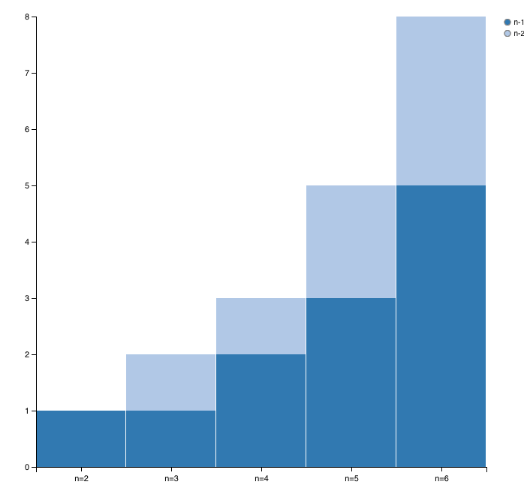

Gyptis, a clojure/script data visualization library for the web, based on vega.js
===

**[Vega](https://github.com/vega/vega)** is a javascript library for
  creating data visualizations through a declarative JSON format.

**Gyptis** helps you produce, modify and render Vega JSON specs. It
  supports common visualization designs like bar and line charts, and
  even choropleth maps.

Leiningen coordinates
---
```clojure
[gyptis "0.2.1"]
```

Usage
---
Take a look at the [examples](examples/gyptis-usage), or watch the video

[](https://www.youtube.com/watch?v=bpYCDYpioqg)

```clojure
(use 'gyptis.core)
(require '[gyptis.view :refer [plot!]])

(def data [{:x "n=2", :y 1 :fill "n-1"}
           {:x "n=2", :y 0 :fill "n-2"}
           {:x "n=3", :y 1 :fill "n-1"}
           {:x "n=3", :y 1 :fill "n-2"}
           {:x "n=4", :y 2 :fill "n-1"}
           {:x "n=4", :y 1 :fill "n-2"}
           {:x "n=5", :y 3 :fill "n-1"}
           {:x "n=5", :y 2 :fill "n-2"}
           {:x "n=6", :y 5 :fill "n-1"}
           {:x "n=6", :y 3 :fill "n-2"}])

(plot! (stacked-bar data))
```


Documentation
---
- [API Docs](http://dvdt.github.io/gyptis/)

Changelog
===

0.2.0
---
**Breaking changes**
- Removes ability to bind vega_templates/*x*, etc. to
  aesthetics. Binding data to aesthetics is now passed to gyptis
  functions as option maps.
- Rename facet-global => facet-grid
- Rename core.cljs => client.cljs. (This is CLJS code that interops
  with vega within the browser.)
